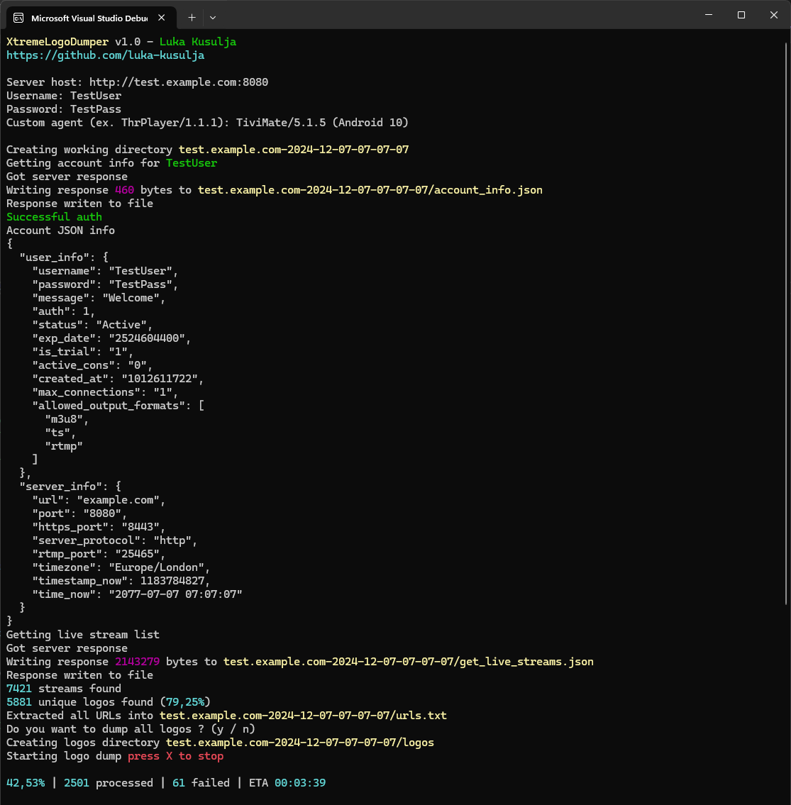

<h1 align="center">
    XtremeLogoDumper 
</h1>

    Saw some pretty logos ? Take a backup !

    

# How to use
1. Run the program
2. Input your credentials for the xtreme server
3. Wait for it to finish

# What is the output ?
| Filename              | Content                                 |
|-----------------------|-----------------------------------------|
| account_info.json     | Your account information                |
| get_live_streams.json | Metadata from the stream sources        |
| urls.txt              | URLs to the logos                       |
| `logos`               | All the images                          |
| failed.txt            | URLs for images that failed to download |